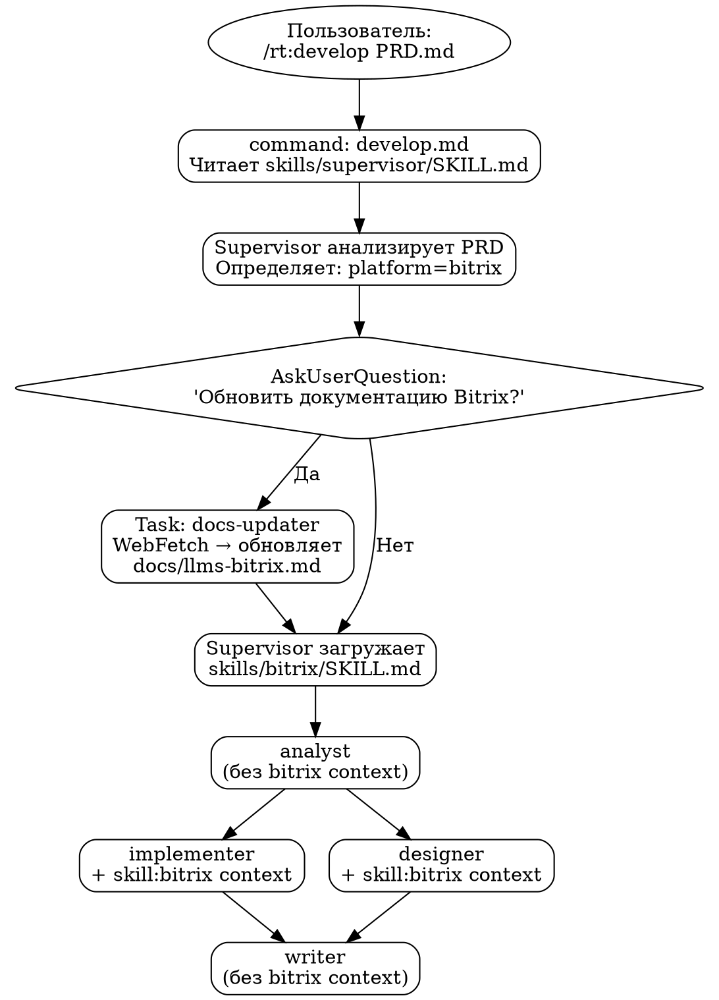
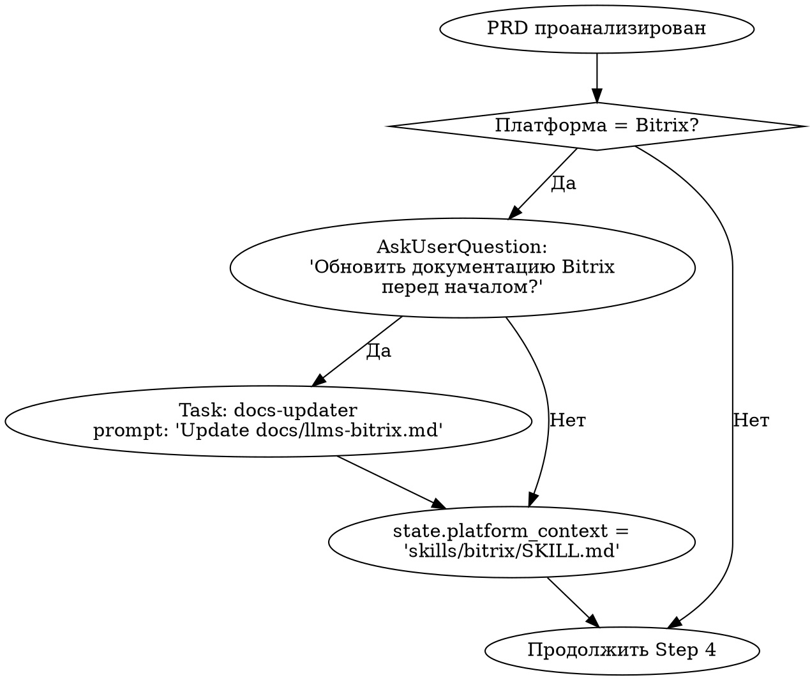
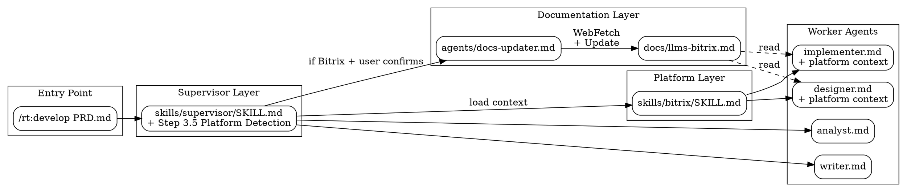

# Bitrix Skill Design v2

> Дата: 2026-01-29
> Статус: Approved

## Overview

Универсальный skill для разработки на Bitrix Framework (лендинги и модули) с интеграцией в supervisor workflow. Включает модульный субагент `docs-updater` для обновления индекса документации.

## Общий Flow



## Файловая структура

```
plugins/real-tools/
├── .claude-plugin/
│   └── plugin.json                    # Добавить skills/bitrix в discovery
├── agents/
│   ├── docs-updater.md                # НОВЫЙ: субагент обновления документации
│   ├── analyst.md
│   ├── implementer.md                 # Модифицировать: читать bitrix context
│   ├── designer.md                    # Модифицировать: читать bitrix context
│   ├── writer.md
│   ├── critique.md
│   └── tester.md
├── commands/
│   ├── supervisor.md
│   └── develop.md                     # НОВЫЙ: алиас для /rt:develop
├── skills/
│   ├── supervisor/
│   │   └── SKILL.md                   # Модифицировать: добавить platform detection
│   └── bitrix/                        # НОВЫЙ: skill для Bitrix платформы
│       ├── SKILL.md                   # Инструкции для implementer/designer
│       └── README.md                  # Документация для пользователей
└── docs/
    └── llms-bitrix.md                 # Существующий: обновляется docs-updater
```

### Принцип модульности

- `docs-updater.md` — отдельный агент с YAML-фронтматтером, запускается supervisor до основного workflow
- `skills/bitrix/SKILL.md` — платформо-специфичные инструкции, НЕ содержит логику обновления
- `docs/llms-bitrix.md` — единый источник истины для Bitrix документации

### Разделение ответственности

| Компонент | Ответственность |
|-----------|-----------------|
| docs-updater | **когда** и **как** обновлять документацию |
| skill:bitrix | **что** знать при разработке под Bitrix |
| llms-bitrix.md | **источник** актуальной документации |

## Компонент 1: agents/docs-updater.md

```yaml
---
name: docs-updater
description: Updates platform documentation index before development tasks. Fetches current API patterns and best practices from official sources.
---
```

### Задача агента

1. Получить путь к целевому файлу документации (`docs/llms-bitrix.md`)
2. Прочитать текущий индекс, определить разделы для обновления
3. Выполнить WebFetch на ключевые URL из раздела "Основные порталы документации"
4. Извлечь актуальные паттерны: версии API, deprecated методы, новые классы
5. Обновить соответствующие секции в файле документации
6. Создать краткий отчёт об изменениях

### Целевые URL для WebFetch (Bitrix)

```
- https://dev.1c-bitrix.ru/api_d7/                    # D7 API изменения
- https://dev.1c-bitrix.ru/rest_help/                 # REST API
- https://dev.1c-bitrix.ru/api_d7/bitrix/landing/     # Landing модуль
- https://dev.1c-bitrix.ru/api_d7/bitrix/ui/          # UI библиотека
```

### Ограничения

- Не удалять существующие ссылки без явного указания "deprecated"
- Добавлять timestamp последнего обновления в начало файла
- Максимум 4 WebFetch запроса за один запуск (rate limiting)

## Компонент 2: skills/bitrix/SKILL.md

```yaml
---
name: bitrix
version: 1.0.0
description: Platform-specific instructions for Bitrix Framework development (landings, modules, components)
---
```

### Структура контента

```markdown
# Bitrix Development Context

## Применение
Этот skill применяется к субагентам: **implementer**, **designer**

## Архитектурные принципы
- Все кастомизации в `/local/`, не в `/bitrix/`
- Предпочитать D7 (Bitrix\*) над старым ядром (C*)
- Обязательное кэширование компонентов

## Для Implementer

### Структура кода
[Ссылки на секции из docs/llms-bitrix.md]

### Обязательные проверки
- B_PROLOG_INCLUDED в каждом PHP файле
- CSRF токены (bitrix_sessid)
- Экранирование вывода

### Паттерны
[ORM, EventManager, компоненты]

## Для Designer

### UI компоненты Bitrix
[Ссылки на UI библиотеку]

### Landing блоки
[Структура блоков, редактируемые области]

### Шаблоны
[header.php, footer.php, #WORK_AREA#]

## Ссылка на полную документацию
Актуальный индекс: `docs/llms-bitrix.md`
```

## Компонент 3: Модификация supervisor/SKILL.md

### Step 3.5: Platform Detection

Добавить после Step 3 (Explore PRD):



### Детекция Bitrix

Ключевые индикаторы в PRD:
- "Bitrix", "1C-Битрикс", "Битрикс24", "БУС"
- "инфоблок", "iblock", "highload"
- "D7", "компонент Bitrix", "landing"
- Домены: *.bitrix24.ru, *.1c-bitrix.ru

### Сохранение в state.json

```json
{
  "platform": "bitrix",
  "platform_context": "skills/bitrix/SKILL.md",
  "docs_updated": true,
  "docs_update_timestamp": "2026-01-29T..."
}
```

### Модификация Step 10 и 13

При делегации в implementer/designer добавить в промпт:
```
Если state.platform_context существует:
  "Прочитай {state.platform_context} и docs/llms-bitrix.md для платформо-специфичного контекста."
```

## Компонент 4: Модификация implementer.md

Добавить секцию Platform Context Integration:

```markdown
## Platform Context Integration

При получении задачи от supervisor:

1. Проверить наличие platform_context в промпте
2. Если указан путь к skill (например `skills/bitrix/SKILL.md`):
   - Прочитать skill файл
   - Прочитать связанную документацию (`docs/llms-bitrix.md`)
   - Применять платформо-специфичные паттерны

### Bitrix-специфичные требования (когда platform=bitrix):
- Код размещать в `/local/` структуре
- Использовать D7 namespace `Bitrix\*`
- Добавлять `if(!defined("B_PROLOG_INCLUDED"))...` в PHP файлы
- Использовать ORM вместо прямых SQL
- Регистрировать события через EventManager
```

## Компонент 5: Модификация designer.md

Добавить секцию Platform Context Integration:

```markdown
## Platform Context Integration

При получении задачи от supervisor:

1. Проверить наличие platform_context в промпте
2. Если указан путь к skill:
   - Прочитать skill файл для UI constraints
   - Использовать платформенные UI компоненты

### Bitrix-специфичные требования (когда platform=bitrix):
- Использовать Landing блоки для лендингов
- Шаблоны: header.php/footer.php с #WORK_AREA#
- Включаемые области для редактируемого контента
- UI библиотека Bitrix для интерфейсных компонентов
```

## Итоговая архитектура



## План реализации

### Создаваемые файлы

| Файл | Тип | Описание |
|------|-----|----------|
| `agents/docs-updater.md` | Новый | Агент обновления документации |
| `skills/bitrix/SKILL.md` | Новый | Платформенный skill |
| `skills/bitrix/README.md` | Новый | Документация skill |
| `commands/develop.md` | Новый | Команда /rt:develop |

### Модифицируемые файлы

| Файл | Изменение |
|------|-----------|
| `skills/supervisor/SKILL.md` | Step 3.5 + platform context injection |
| `agents/implementer.md` | Platform context integration |
| `agents/designer.md` | Platform context integration |

### Порядок реализации

1. Создать `agents/docs-updater.md`
2. Создать `skills/bitrix/SKILL.md` и `README.md`
3. Создать `commands/develop.md`
4. Модифицировать `skills/supervisor/SKILL.md`
5. Модифицировать `agents/implementer.md`
6. Модифицировать `agents/designer.md`
7. Тестирование полного flow
